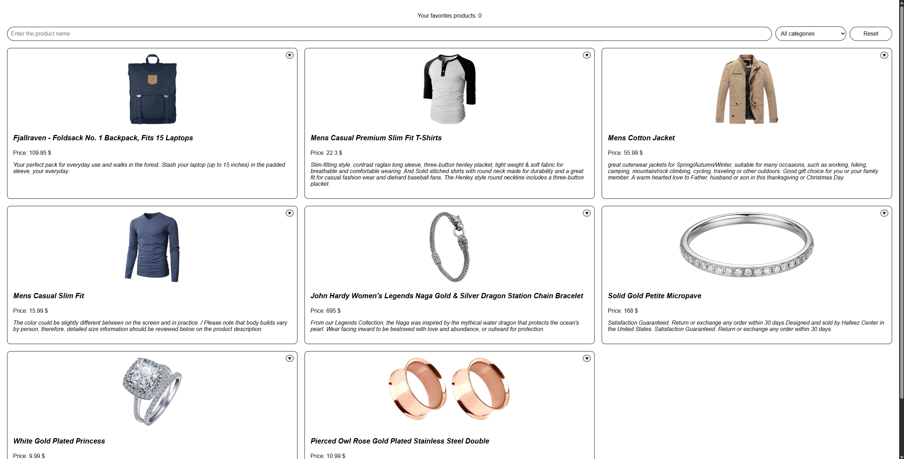
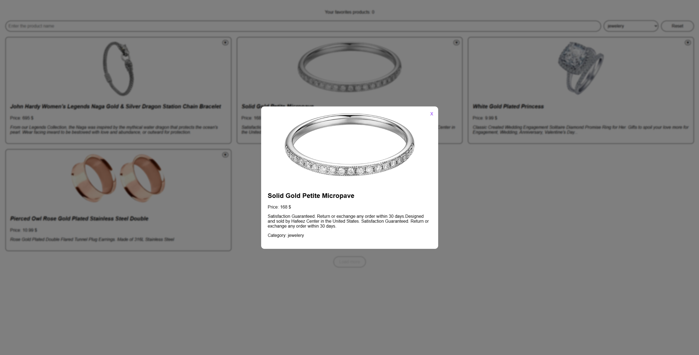
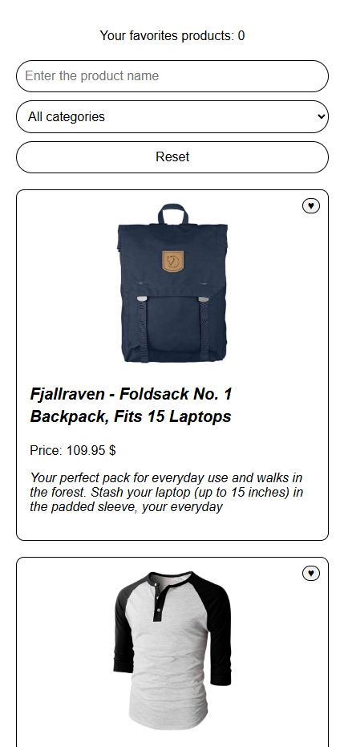

# Catalog FakeStore

Simple product catalog built with **FakeStoreAPI**.  
Supports search, category filtering, favorites, pagination and product modal.

## Live Demo

https://netkamaa.github.io/Catalog-FakeStore/

---

# Features

- Product loading from FakeStoreAPI
- Search with debounce
- Category filtering
- Show more pagination
- Favorites with localStorage persistence
- Product modal window
- Modal close via overlay / ESC / close button
- Loading / error / empty states
- Responsive layout (mobile / tablet / desktop)

---

# Technologies

- HTML5
- CSS3
- Vanilla JavaScript
- ES Modules
- FakeStoreAPI

---

# How to run locally

1. Clone repository

git clone https://github.com/NetKamaa/Catalog-FakeStore.git

2. Go to project folder

cd Catalog-FakeStore

3. Run local server (for example VS Code Live Server)

4. Open in browser

http://localhost:5500

---

# Project Structure

src
├── api.js
├── elements.js
├── handlers.js
├── main.js
├── render.js
├── state.js
└── utils.js

index.html
main.css
README.md

---

# Screenshots

## Catalog

## Product Modal

## Mobile Version

---

# Architecture

The application follows a simple **state-driven architecture**.

- `state.js` — global application state
- `render.js` — UI rendering
- `handlers.js` — user interaction handlers
- `utils.js` — filtering and pagination logic
- `api.js` — API data loading

Application flow:

API → state → render → DOM

---

# License

Educational project.
